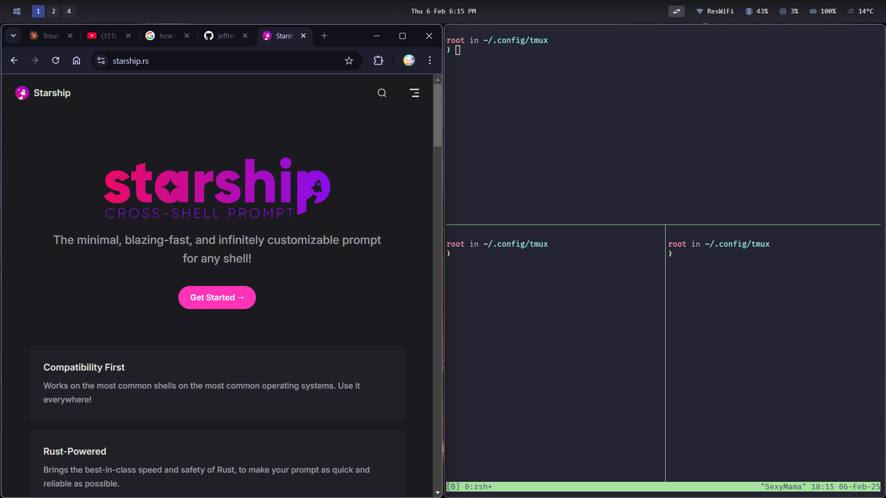

# Contributors
Victor Perez Contreras

# Usage
```bash
#Installation:
./main.sh
```
Note:
    After Installing packages reload the terminal and or VM/PC. 
    This allows the terminal to properly source the fonts.

# Updating Files

For windows users there is an easy way to link your files. This enables quick functionality to updating files for pushing to GitHub.


```bash
# Prints the possible commands
make
```

```bash
# Prep the files for uploading to GitHub
make upload
```
*Note:* 
Prepping in the Makefile works for my system. Specify the file locations 
if you need to move them. For instance, .wezterm.lua is located in 
__/mnt/c/Users/{username}/__. Depending on your system username it may 
need to be updated.

# Setup: Windows



# Components and Reasoning

## OS: Arch

Very difficult learning curve with a large reward. Learning arch has made 
me extremely comfortable in the terminal. I am now fairly proficient in 
connecting in to wifi (iwctl), managing packages and conflits using yay 
and pacman, and fairly deep into ricing.

## Editor: Neovim

I love vim but wanted to add more functionality and customization for 
specific use cases. Neovim has allowed be to improve my vim experience
with customization such as a file tree system, LSPs, and other functions
that I have incorporated into my enviorment.

## Terminal Prompt: Starship

- Fast and light way terminal. 

- Very sleek as well.

## ZSH

Allows for autocompletion and history, greatly increasing workflow.

## WezTerm

Easy to use on windows and customizable. Helps remove key binding 
conflicts from the base Windows terminal emulator. WSL is better 
but has many keybing conflicts.

## Terminal Multiplexer: Zellij

Tmux is amazing but I have a lot of issues with configurations 
and resurrection of sessions. Instead of dealing with the forever, 
I have deciced to learn zellij to perhaps improve my terminal 
multiplexing experience.

# Inspiration

## NVIM

Based off of: https://github.com/cpow/neovim-for-newbs

Cpow created a short series giving a tutorial on how to install Neovim. 
There are adjustments such as language specific LSPs, updates to outdate 
repositories, and other small tweaks for the vim configurations.

I adapted this setup to properly install the rest of my WSL setup.

## Waybar, Wofi, and SwayNC 

***Contributor: Eli Fouts***

***Link: https://github.com/elifouts/Dotfiles.git***

### Waybar 

Amazing sleek design. Improvements were made for my liking such as adding a 
power button, coloring the bar, and editing the active layout button to my likings.

### Wofi

Adjusted the blur to fit my likings.

### SwayNC

Removed icons, changed the color scheme, and made other small tweaks.

# Windows Specific

Glaze: https://github.com/glzr-io/glazewm

Config file stored manually. Copy file to setup folder.

